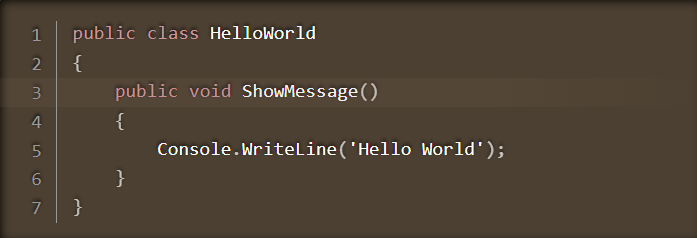

# Markdig.Extensions.LineHighlight

This package can be used to highlight code lines. It uses [Prism](https://prismjs.com/) for highlighting.

## Installation & Configuration

1. Install the package:

```bash
dotnet add package CodeLineHighlight --version 1.0.0
```

2. Download prism.js for code-highlighting support and put it into your libs folder:

> You can install it from: https://prismjs.com/download.html

Then, add prism.cs and prism.js files to your layout.

```html
<!DOCTYPE html>
<html lang="en">
   <head>
      <!-- code abbreviated for simplicity -->
      <link rel="stylesheet" href="~/css/prism.css" asp-append-version="true"/> 
   </head>
   <body>
      <!-- code abbreviated for simplicity -->
      <script src="~/js/prism.js" asp-append-version="true"></script>  
   </body>
</html>
```

## Usage

Let's assume you have markdown content and want to highlight the 3rd line. You can do this as below (just specify `{line-number}` next to the language):

```html
   ```csharp {3}
      public class HelloWorld 
      {
         public void ShowMessage() 
         {
            Console.WriteLine("Hello World");
         }
      }
   \```
```

> You can specify more than one line to highlight and also specify line intervals to highlight. For example, `csharp {3-5, 7}` with such use, the 3rd, 4th, 5th and 7th lines will be highlighted.

To render this markdown as HTML, you can use `Markdown.ToHtml` method. This method basically gets two parameters: the first one is the markdown content and the second one is a pipeline, which can be considered custom steps that we want to apply while rendering the content as HTML.

You need to add [HighlightedCodeBlockExtension](https://github.com/EngincanV/Markdig.Extensions.LineHighlight/blob/main/src/Markdig.Extensions.LineHighlight/Markdown/Extensions/HighlightedCodeBlockExtension.cs#L8) to this pipeline to the benefit of code-highlighting. For this purpose, you can use the `UseHighlightedCodeBlocks` method while building the pipeline and passing it through the `Markdown.ToHtml` method as below:

```csharp
   var pipeline = new MarkdownPipelineBuilder()
      .UseHighlightedCodeBlocks() //use highlighted code blocks 
      .Build();
   var result = Markdown.ToHtml(text.ToString(), pipeline);
```

Then, if you added the prism.js into your layout as mentioned above, you should see an output as follows:



## Samples

This repository contains one sample application named `LineHighlightDemo`, which you can see [under the demo folder](demo/LineHighlightDemo/). If you encounter a problem, you can check this sample application.
